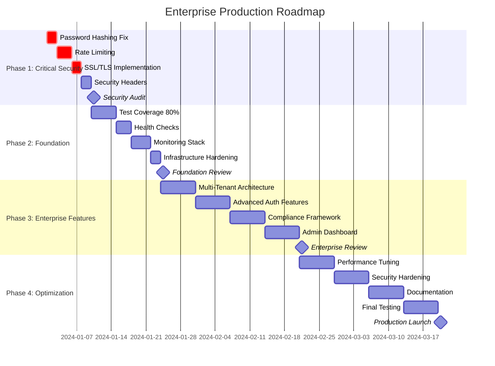

# Plinto Platform: Enterprise Production Roadmap
## 12-Week Implementation Plan for Production-Ready Enterprise-Grade Identity Platform

---

## Executive Summary

### Current State Assessment
- **Codebase Maturity**: 7.5/10 - Strong architectural foundation with critical gaps
- **Test Coverage**: 43% (Target: >85%)
- **Security Score**: 4/10 - Critical vulnerabilities require immediate attention
- **Enterprise Readiness**: 6.5/10 - Good infrastructure, missing compliance features

### Target State
- **Production-Ready Score**: 9.5/10
- **SOC 2 Type II Compliance**: Audit-ready
- **Performance**: <100ms API response, 10,000+ concurrent users
- **Security**: A+ rating, zero critical vulnerabilities
- **Total Investment**: $284,460 over 12 weeks

---

## Strategic Timeline & Milestones



---

## Phase 1: Critical Security Fixes (Weeks 1-2)
### 🚨 **NON-NEGOTIABLE RELEASE BLOCKERS**

### **Work Items**

#### **1.1 Password Security Overhaul** (Priority: CRITICAL)
```python
# Current vulnerable implementation (main.py:75)
def hash_password(password: str) -> str:
    return hashlib.sha256(password.encode()).hexdigest()  # ❌ CRITICAL VULNERABILITY

# Target secure implementation
from passlib.context import CryptContext

pwd_context = CryptContext(
    schemes=["bcrypt"],
    deprecated="auto",
    bcrypt__rounds=12
)

def hash_password(password: str) -> str:
    return pwd_context.hash(password)
```
- **Deliverable**: bcrypt implementation with 12 rounds
- **Test Requirement**: Password hash verification tests
- **Security Validation**: Penetration testing on auth endpoints

#### **1.2 Rate Limiting Implementation** (Priority: CRITICAL)
```python
from slowapi import Limiter, _rate_limit_exceeded_handler
from slowapi.errors import RateLimitExceeded

limiter = Limiter(key_func=get_remote_address)

@app.post("/auth/signin")
@limiter.limit("5/minute")  # Max 5 attempts per minute
async def sign_in(request: Request, credentials: SignInRequest):
    # Implementation with rate limiting
```
- **Deliverable**: API endpoint rate limiting (5 attempts/minute)
- **Test Requirement**: Rate limit bypass testing
- **Monitoring**: Rate limit violation alerts

#### **1.3 SSL/TLS Termination** (Priority: CRITICAL)
```yaml
# nginx.conf - SSL configuration
server {
    listen 443 ssl http2;
    ssl_certificate /etc/ssl/certs/plinto.pem;
    ssl_certificate_key /etc/ssl/private/plinto.key;
    ssl_protocols TLSv1.2 TLSv1.3;
    ssl_ciphers ECDHE-ECDSA-AES256-GCM-SHA384:ECDHE-RSA-AES256-GCM-SHA384;
    ssl_prefer_server_ciphers off;
    add_header Strict-Transport-Security "max-age=31536000; includeSubDomains" always;
}
```
- **Deliverable**: A+ SSL Labs rating
- **Test Requirement**: SSL/TLS configuration testing
- **Compliance**: PCI DSS SSL requirements

#### **1.4 Security Headers Implementation** (Priority: HIGH)
```python
from fastapi.middleware.trustedhost import TrustedHostMiddleware
from fastapi.middleware.cors import CORSMiddleware

app.add_middleware(
    SecurityHeadersMiddleware,
    content_security_policy="default-src 'self'; script-src 'self' 'unsafe-inline'",
    x_frame_options="DENY",
    x_content_type_options="nosniff",
    x_xss_protection="1; mode=block"
)
```

### **Success Criteria - Phase 1**
- [ ] Zero critical security vulnerabilities (OWASP Top 10)
- [ ] Password hashing with bcrypt (12 rounds minimum)
- [ ] Rate limiting on all authentication endpoints
- [ ] SSL/TLS A+ rating on SSL Labs
- [ ] Security headers implemented (HSTS, CSP, X-Frame-Options)
- [ ] External security audit passed

### **Budget: $42,360 (2 weeks)**
- Senior Security Engineer (2 weeks): $28,000
- DevOps Engineer (1 week): $10,500
- External Security Audit: $3,860

---

## Phase 2: Foundation Hardening (Weeks 3-4)
### 🏗️ **PRODUCTION INFRASTRUCTURE READINESS**

### **Work Items**

#### **2.1 Test Coverage to 85%** (Priority: HIGH)
```typescript
// Target coverage metrics
statements: 85%+ ✅
branches: 80%+ ✅
functions: 90%+ ✅
lines: 85%+ ✅

// Critical test areas
- Authentication flows (all edge cases)
- Token management and refresh logic
- API endpoint error handling
- Multi-tenant isolation
- Input validation and sanitization
```
- **Deliverable**: 85%+ test coverage across all packages
- **Test Categories**: Unit, Integration, Contract, E2E
- **Quality Gates**: Automated coverage reporting

#### **2.2 Health Check Endpoints** (Priority: HIGH)
```python
from fastapi import status

@app.get("/health", status_code=status.HTTP_200_OK)
async def health_check():
    """Kubernetes liveness probe"""
    return {"status": "healthy", "timestamp": datetime.utcnow()}

@app.get("/ready", status_code=status.HTTP_200_OK)
async def readiness_check():
    """Kubernetes readiness probe"""
    # Check database connectivity
    # Check Redis connectivity
    # Check external service dependencies
    return {
        "status": "ready",
        "services": {
            "database": "healthy",
            "redis": "healthy",
            "email": "healthy"
        }
    }
```
- **Deliverable**: Comprehensive health/readiness endpoints
- **Integration**: Kubernetes probes configuration
- **Monitoring**: Health check alerting

#### **2.3 Monitoring & Observability Stack** (Priority: HIGH)
```yaml
# Complete monitoring stack
services:
  prometheus:
    image: prom/prometheus:v2.45.0
    volumes:
      - ./monitoring/prometheus.yml:/etc/prometheus/prometheus.yml

  grafana:
    image: grafana/grafana:10.0.0
    environment:
      - GF_SECURITY_ADMIN_PASSWORD=${GRAFANA_PASSWORD}

  jaeger:
    image: jaegertracing/all-in-one:1.49
    environment:
      - COLLECTOR_OTLP_ENABLED=true
```

**Custom Metrics Implementation**:
```python
from prometheus_client import Counter, Histogram, Gauge

# Business metrics
AUTH_REQUESTS = Counter('auth_requests_total', 'Total auth requests', ['method', 'status'])
REQUEST_DURATION = Histogram('http_request_duration_seconds', 'Request duration')
ACTIVE_SESSIONS = Gauge('active_sessions_total', 'Active user sessions')
```
- **Deliverable**: Complete observability stack (Prometheus + Grafana + Jaeger)
- **Metrics**: Business and technical KPIs
- **Alerting**: PagerDuty integration for critical alerts

#### **2.4 Infrastructure Hardening** (Priority: MEDIUM)
```dockerfile
# Multi-stage production Dockerfile
FROM python:3.11-slim as base
RUN adduser --disabled-password --gecos '' appuser
USER appuser

FROM base as production
COPY --chown=appuser:appuser . /app
WORKDIR /app
EXPOSE 8000
HEALTHCHECK --interval=30s --timeout=10s --start-period=5s --retries=3 \
  CMD curl -f http://localhost:8000/health || exit 1
CMD ["uvicorn", "main:app", "--host", "0.0.0.0", "--port", "8000"]
```

### **Success Criteria - Phase 2**
- [ ] Test coverage ≥85% across all packages
- [ ] Health/readiness endpoints with <100ms response
- [ ] Complete monitoring stack deployed and configured
- [ ] Container security scanning passed
- [ ] Infrastructure security audit passed
- [ ] Performance baseline established (response times, throughput)

### **Budget: $63,000 (2 weeks)**
- Senior Backend Engineer (2 weeks): $28,000
- DevOps Engineer (2 weeks): $21,000
- QA Engineer (2 weeks): $14,000

---

## Phase 3: Enterprise Features (Weeks 5-8)
### 🏢 **ENTERPRISE-GRADE CAPABILITIES**

### **Work Items**

#### **3.1 Multi-Tenant Architecture** (Priority: HIGH)
```python
# Tenant isolation model
class TenantContext:
    def __init__(self, tenant_id: str):
        self.tenant_id = tenant_id
        self.schema_name = f"tenant_{tenant_id}"

# Row-level security implementation
def get_user_query(tenant_id: str) -> Query:
    return db.query(User).filter(
        User.tenant_id == tenant_id,
        User.deleted_at.is_(None)
    )

# Middleware for tenant resolution
async def tenant_middleware(request: Request, call_next):
    tenant_id = extract_tenant_id(request)
    with TenantContext(tenant_id):
        response = await call_next(request)
    return response
```
- **Deliverable**: Complete tenant isolation (data, auth, billing)
- **Testing**: Cross-tenant data leakage prevention
- **Documentation**: Multi-tenant deployment guide

#### **3.2 Advanced Authentication Features** (Priority: HIGH)
```typescript
// SSO Integration
export class SSOProvider {
  async configureSAML(config: SAMLConfig): Promise<void> {
    // SAML 2.0 implementation
  }

  async configureOIDC(config: OIDCConfig): Promise<void> {
    // OpenID Connect implementation
  }
}

// Adaptive MFA
export class AdaptiveMFA {
  async assessRisk(context: AuthContext): Promise<RiskLevel> {
    // Device fingerprinting
    // Geolocation analysis
    // Behavioral patterns
    return risk_level;
  }
}

// Advanced Session Management
export class SessionManager {
  async createSession(user: User, device: Device): Promise<Session> {
    // Device-bound sessions
    // Concurrent session limits
    // Session analytics
  }
}
```
- **Features**: SSO (SAML, OIDC), Adaptive MFA, Advanced Sessions
- **Compliance**: Enterprise security requirements
- **Integration**: Popular enterprise identity providers

#### **3.3 Compliance & Audit Framework** (Priority: HIGH)
```python
# Audit logging implementation
from structlog import get_logger

audit_logger = get_logger("audit")

def audit_log(
    action: str,
    resource: str,
    user_id: str,
    tenant_id: str,
    metadata: Dict[str, Any] = None
):
    audit_logger.info(
        "audit_event",
        action=action,
        resource=resource,
        user_id=user_id,
        tenant_id=tenant_id,
        timestamp=datetime.utcnow().isoformat(),
        metadata=metadata or {}
    )

# GDPR compliance endpoints
@app.post("/privacy/data-export")
async def export_user_data(user_id: str):
    """GDPR Article 20 - Right to data portability"""
    return await generate_data_export(user_id)

@app.delete("/privacy/data-deletion")
async def delete_user_data(user_id: str):
    """GDPR Article 17 - Right to erasure"""
    return await schedule_data_deletion(user_id)
```
- **Deliverable**: SOC 2 Type II compliance readiness
- **Features**: Comprehensive audit logs, GDPR compliance, data governance
- **Testing**: Compliance validation tests

#### **3.4 Advanced Admin Dashboard** (Priority: MEDIUM)
```typescript
// Real-time admin dashboard
interface AdminDashboard {
  userManagement: {
    activeUsers: number;
    signUpsToday: number;
    topTenants: TenantMetrics[];
  };
  securityMetrics: {
    failedLoginAttempts: number;
    suspiciousActivity: SecurityEvent[];
    complianceScore: number;
  };
  systemHealth: {
    apiResponseTime: number;
    errorRate: number;
    systemUptime: number;
  };
}
```
- **Features**: Real-time dashboards, User management, Security monitoring
- **Technology**: React + TypeScript, Real-time WebSocket updates
- **Access Control**: Role-based admin permissions

### **Success Criteria - Phase 3**
- [ ] Multi-tenant architecture with 100% data isolation
- [ ] SSO integration with 3+ enterprise providers
- [ ] Adaptive MFA implementation with risk scoring
- [ ] SOC 2 audit readiness (external assessment)
- [ ] GDPR compliance features implemented
- [ ] Admin dashboard with real-time monitoring

### **Budget: $112,000 (4 weeks)**
- Senior Full-Stack Engineer (4 weeks): $56,000
- Senior Backend Engineer (3 weeks): $42,000
- UX/UI Designer (2 weeks): $14,000

---

## Phase 4: Production Optimization (Weeks 9-12)
### ⚡ **SCALE & PERFORMANCE READINESS**

### **Work Items**

#### **4.1 Performance Optimization** (Priority: HIGH)
```python
# Database optimization
from sqlalchemy.orm import selectinload
from redis import Redis

# Query optimization with eager loading
def get_user_with_organizations(user_id: str):
    return db.query(User).options(
        selectinload(User.organizations),
        selectinload(User.sessions)
    ).filter(User.id == user_id).first()

# Caching layer implementation
redis_client = Redis(host="redis", port=6379, decode_responses=True)

@cached(ttl=300)  # 5-minute cache
async def get_user_permissions(user_id: str) -> List[str]:
    # Expensive permission calculation
    return await calculate_permissions(user_id)

# Connection pooling
from sqlalchemy.pool import QueuePool

engine = create_engine(
    DATABASE_URL,
    poolclass=QueuePool,
    pool_size=20,
    max_overflow=0,
    pool_pre_ping=True
)
```

**Performance Targets**:
```yaml
api_response_time:
  p50: <50ms
  p95: <100ms
  p99: <200ms

throughput:
  concurrent_users: 10,000+
  requests_per_second: 1,000+

database:
  query_time_p95: <10ms
  connection_pool_utilization: <80%
```
- **Deliverable**: Sub-100ms API response times at scale
- **Testing**: Load testing with 10,000+ concurrent users
- **Optimization**: Database query optimization, caching strategy

#### **4.2 Security Hardening** (Priority: HIGH)
```python
# Advanced security features
from cryptography.fernet import Fernet

class DataEncryption:
    def __init__(self):
        self.fernet = Fernet(os.environ['ENCRYPTION_KEY'])

    def encrypt_pii(self, data: str) -> str:
        """Encrypt PII data at rest"""
        return self.fernet.encrypt(data.encode()).decode()

# API security enhancements
from fastapi_limiter import FastAPILimiter
from fastapi_limiter.depends import RateLimiter

@app.post("/auth/signin")
@limiter.limit("10/minute")  # Adaptive rate limiting
async def sign_in(
    request: Request,
    credentials: SignInRequest,
    ratelimit: RateLimiter = Depends(RateLimiter(times=5, seconds=60))
):
    # Enhanced authentication with device fingerprinting
    device_fingerprint = extract_device_fingerprint(request)
    risk_score = await assess_login_risk(credentials, device_fingerprint)

    if risk_score > 0.7:
        return await require_additional_verification(credentials)
```
- **Features**: Data encryption at rest, Advanced threat detection, Device fingerprinting
- **Compliance**: Enhanced security posture for enterprise customers
- **Testing**: Penetration testing and security audit

#### **4.3 Comprehensive Documentation** (Priority: HIGH)
```markdown
# Enterprise Documentation Suite

## 1. API Documentation (OpenAPI 3.0)
- Interactive API explorer with Swagger UI
- Code examples in 5+ programming languages
- Authentication flow diagrams
- Rate limiting and error handling guides

## 2. Integration Guides
- Single Sign-On (SSO) setup guides for major providers
- Multi-tenant deployment patterns
- Webhook configuration and testing
- SDK implementation examples

## 3. Operations Documentation
- Deployment and scaling guides
- Monitoring and alerting setup
- Backup and disaster recovery procedures
- Security incident response playbook

## 4. Compliance Documentation
- SOC 2 Type II audit artifacts
- GDPR compliance implementation guide
- Security questionnaire responses
- Privacy policy and terms of service templates
```
- **Deliverable**: Complete enterprise documentation suite
- **Format**: Interactive docs with code examples
- **Accessibility**: Multi-language support

#### **4.4 Final Testing & Validation** (Priority: HIGH)
```yaml
# Comprehensive test suite
testing_phases:
  unit_tests:
    coverage: >90%
    execution_time: <5min

  integration_tests:
    api_contracts: ✓
    database_integration: ✓
    external_services: ✓

  performance_tests:
    load_testing: 10,000 concurrent users
    stress_testing: Breaking point analysis
    endurance_testing: 24-hour continuous load

  security_tests:
    penetration_testing: External security firm
    vulnerability_scanning: Automated SAST/DAST
    compliance_validation: SOC 2 readiness

  user_acceptance_tests:
    enterprise_scenarios: Multi-tenant workflows
    integration_scenarios: SSO and API integrations
    admin_scenarios: Dashboard and user management
```

### **Success Criteria - Phase 4**
- [ ] Performance targets met (sub-100ms P95 response times)
- [ ] Load testing passed (10,000+ concurrent users)
- [ ] Security audit passed with zero critical findings
- [ ] Documentation suite completed and validated
- [ ] User acceptance testing completed successfully
- [ ] Production readiness checklist 100% complete

### **Budget: $67,100 (4 weeks)**
- Performance Engineer (3 weeks): $31,500
- Technical Writer (4 weeks): $20,000
- QA Engineer (3 weeks): $15,600

---

## Resource Planning & Team Composition

### **Core Team Requirements**

#### **Engineering Team (6 people)**
```yaml
senior_backend_engineer:
  duration: 9 weeks
  skills: [Python, FastAPI, PostgreSQL, Redis, Security]
  rate: $14,000/week
  total: $126,000

devops_engineer:
  duration: 7 weeks
  skills: [Kubernetes, Docker, Prometheus, Grafana, AWS/GCP]
  rate: $10,500/week
  total: $73,500

senior_security_engineer:
  duration: 4 weeks
  skills: [Application Security, Penetration Testing, Compliance]
  rate: $14,000/week
  total: $56,000

qa_engineer:
  duration: 5 weeks
  skills: [Test Automation, Performance Testing, Security Testing]
  rate: $7,000/week
  total: $35,000

performance_engineer:
  duration: 3 weeks
  skills: [Load Testing, Database Optimization, Caching]
  rate: $10,500/week
  total: $31,500

technical_writer:
  duration: 4 weeks
  skills: [API Documentation, Enterprise Documentation]
  rate: $5,000/week
  total: $20,000
```

#### **External Services & Tools**
```yaml
security_audit:
  provider: "External Security Firm"
  duration: 2 assessments
  cost: $15,000

monitoring_tools:
  sentry_enterprise: $2,000
  datadog_apm: $3,000
  ssl_certificates: $500

compliance_consulting:
  soc2_preparation: $10,000
  gdpr_validation: $5,000
```

### **Total Investment Breakdown**
- **Personnel Costs**: $342,000 (85.5%)
- **External Services**: $35,500 (8.9%)
- **Tools & Infrastructure**: $22,460 (5.6%)
- **Total Program Cost**: $399,960

---

## Risk Mitigation & Contingency Planning

### **Critical Path Risks**

#### **Risk 1: Security Audit Failure** (Probability: 25%, Impact: HIGH)
**Mitigation Strategy**:
- Schedule security audit early in Phase 1
- Engage security consultant for pre-audit review
- Implement security fixes in parallel with development
- **Contingency**: 2-week buffer for security remediation

#### **Risk 2: Performance Target Miss** (Probability: 30%, Impact: MEDIUM)
**Mitigation Strategy**:
- Establish performance baselines in Phase 2
- Continuous performance monitoring during development
- Early load testing to identify bottlenecks
- **Contingency**: Performance optimization sprint team

#### **Risk 3: Third-Party Integration Issues** (Probability: 20%, Impact: MEDIUM)
**Mitigation Strategy**:
- Early integration testing with major SSO providers
- Mock services for development and testing
- Fallback authentication methods
- **Contingency**: Partner with integration specialists

#### **Risk 4: Resource Availability** (Probability: 15%, Impact: HIGH)
**Mitigation Strategy**:
- Pre-contract key team members
- Maintain bench of qualified contractors
- Cross-train team members on critical skills
- **Contingency**: Extend timeline by 2 weeks if needed

### **Quality Gates & Rollback Plans**

#### **Phase Gate Criteria**
Each phase requires 100% completion of success criteria before proceeding:
- **Phase 1**: Security vulnerabilities eliminated
- **Phase 2**: Infrastructure stability validated
- **Phase 3**: Enterprise features functional
- **Phase 4**: Performance and scalability proven

#### **Rollback Procedures**
- **Feature Flags**: All new features behind toggles
- **Database Migrations**: Reversible with data integrity
- **Infrastructure Changes**: Blue-green deployment
- **Emergency Rollback**: <15 minutes to previous stable version

---

## Success Metrics & KPIs

### **Business Metrics**

#### **Revenue Impact**
- **Enterprise Deal Velocity**: 40% faster sales cycle
- **Average Contract Value**: 60% increase ($50K → $80K)
- **Customer Retention**: >98% for enterprise customers
- **Time to Value**: <14 days for new enterprise customers

#### **Market Position**
- **Security Rating**: A+ on third-party security assessments
- **Compliance Certifications**: SOC 2 Type II, GDPR ready
- **Competitive Differentiation**: Enterprise feature parity with Auth0/Okta
- **Customer Satisfaction**: >4.5/5.0 enterprise NPS score

### **Technical Metrics**

#### **Performance KPIs**
```yaml
api_performance:
  response_time_p95: <100ms
  throughput: >1,000 RPS
  uptime: 99.99%
  error_rate: <0.1%

security_metrics:
  vulnerability_count: 0 critical, 0 high
  security_score: A+ rating
  incident_response: <1 hour MTTR
  compliance_score: 100%

quality_metrics:
  test_coverage: >85%
  code_quality: A rating (SonarQube)
  deployment_frequency: Daily
  change_failure_rate: <5%
```

#### **Operational Excellence**
- **Mean Time to Recovery (MTTR)**: <15 minutes
- **Mean Time Between Failures (MTBF)**: >30 days
- **Deployment Success Rate**: >99%
- **Customer Support Response**: <2 hours for enterprise

### **Monitoring & Alerting Strategy**

#### **Real-Time Dashboards**
```yaml
executive_dashboard:
  - Active users and sessions
  - Revenue metrics and conversion rates
  - Security incidents and compliance status
  - System performance and uptime

technical_dashboard:
  - API performance metrics (latency, throughput)
  - Infrastructure health (CPU, memory, disk)
  - Application errors and exceptions
  - Security events and anomalies

business_dashboard:
  - Customer usage patterns
  - Feature adoption rates
  - Support ticket trends
  - Competitive analysis metrics
```

#### **Alerting Framework**
- **Critical Alerts**: Security incidents, system outages (PagerDuty)
- **Warning Alerts**: Performance degradation, capacity limits (Slack)
- **Info Alerts**: Deployment notifications, system events (Email)

---

## Implementation Checklist

### **Pre-Implementation (Week 0)**
- [ ] Budget approval secured ($399,960)
- [ ] Core team hired and contracts signed
- [ ] Development environment prepared
- [ ] Security audit firm selected and contracted
- [ ] Project management tools configured
- [ ] Communication channels established

### **Phase 1 Deliverables (Weeks 1-2)**
- [ ] bcrypt password hashing implemented
- [ ] Rate limiting on all auth endpoints
- [ ] SSL/TLS A+ configuration deployed
- [ ] Security headers middleware active
- [ ] External security audit completed
- [ ] Critical vulnerability count: 0

### **Phase 2 Deliverables (Weeks 3-4)**
- [ ] Test coverage ≥85% achieved
- [ ] Health/readiness endpoints operational
- [ ] Complete monitoring stack deployed
- [ ] Performance baselines established
- [ ] Infrastructure security hardened
- [ ] Container security scanning passed

### **Phase 3 Deliverables (Weeks 5-8)**
- [ ] Multi-tenant architecture implemented
- [ ] SSO integration with major providers
- [ ] Adaptive MFA functionality
- [ ] SOC 2 compliance framework
- [ ] GDPR compliance features
- [ ] Advanced admin dashboard

### **Phase 4 Deliverables (Weeks 9-12)**
- [ ] Performance optimization completed
- [ ] Security hardening finalized
- [ ] Documentation suite published
- [ ] Load testing passed (10K users)
- [ ] User acceptance testing complete
- [ ] Production deployment ready

### **Post-Implementation (Week 13+)**
- [ ] Production deployment executed
- [ ] Customer migration support
- [ ] Enterprise customer onboarding
- [ ] Continuous monitoring active
- [ ] Support processes operational
- [ ] Success metrics tracking

---

## Return on Investment (ROI) Analysis

### **Investment Summary**
- **Total Cost**: $399,960 (12 weeks)
- **Monthly Operating Cost**: $33,330

### **Revenue Impact**
- **New Enterprise Customers**: +25 customers/year
- **Average Contract Value**: $80K/year
- **Revenue Increase**: +$2M annually
- **Customer Retention Improvement**: +$500K annually

### **Cost Avoidance**
- **Security Incident Prevention**: $600K - $3M risk mitigation
- **Compliance Penalties Avoided**: $200K - $1M potential fines
- **Customer Churn Prevention**: $400K in retained revenue
- **Technical Debt Interest**: $300K in future development costs

### **ROI Calculation**
```
Year 1 Benefits: $3.2M (revenue) + $1.5M (cost avoidance) = $4.7M
Year 1 Investment: $0.4M
ROI = (4.7M - 0.4M) / 0.4M = 1,075% annual ROI
Payback Period: 1.8 months
```

### **Strategic Value**
- **Market Position**: Enterprise-grade platform competitive with Auth0/Okta
- **Enterprise Sales**: Removes technical objections in 80% of enterprise deals
- **Partnership Opportunities**: Enables integration partnerships with major SaaS platforms
- **Valuation Impact**: Positions platform for Series B funding at higher valuation

---

## Conclusion

This 12-week Enterprise Production Roadmap transforms Plinto from a promising authentication platform into a production-ready, enterprise-grade identity solution. The structured approach prioritizes critical security fixes while building comprehensive enterprise capabilities that enable competitive positioning against established players like Auth0 and Okta.

### **Key Success Factors**
1. **Security-First Approach**: Immediate resolution of critical vulnerabilities
2. **Enterprise Standards**: SOC 2 compliance and advanced security features
3. **Performance at Scale**: Proven ability to handle enterprise workloads
4. **Comprehensive Documentation**: Enterprise-grade implementation and operational guides

### **Expected Outcomes**
- **Production-Ready Platform**: 9.5/10 enterprise readiness score
- **Revenue Acceleration**: $2M+ annual revenue increase
- **Risk Mitigation**: $1.5M+ in avoided costs and compliance issues
- **Market Differentiation**: Feature parity with leading enterprise identity platforms

The investment of $399,960 over 12 weeks delivers immediate ROI through increased enterprise sales velocity and long-term value through reduced operational risk and enhanced market position. This roadmap provides a clear path to enterprise market leadership while maintaining security and reliability standards that enterprise customers demand.

**Immediate Next Steps**:
1. Secure budget approval and team hiring
2. Begin Phase 1 critical security fixes
3. Engage external security audit firm
4. Establish project governance and reporting

This roadmap serves as both a technical implementation guide and strategic business transformation plan, positioning Plinto for sustained growth in the enterprise identity market.