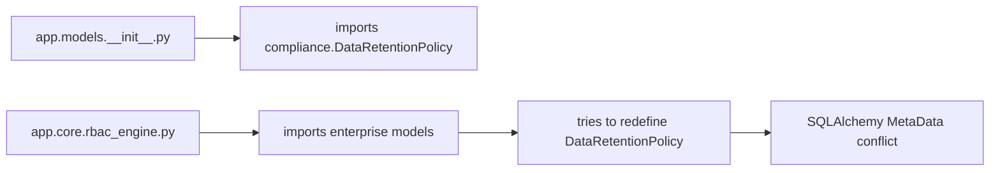

# SQLAlchemy Table Redefinition Error - Root Cause Analysis & Resolution

## 🎯 Problem Summary

**Issue**: `sqlalchemy.exc.InvalidRequestError: Table 'data_retention_policies' is already defined for this MetaData instance`

**Impact**: RBAC tests couldn't run due to import conflicts when importing `app.core.rbac_engine`

## 🔍 Root Cause Analysis

### **Primary Issue: Duplicate Model Definitions**

The error was caused by the `DataRetentionPolicy` class being defined in **two different modules** with the **same table name**:

1. **`/app/models/compliance.py`** - Comprehensive compliance model (20+ columns)
2. **`/app/models/enterprise.py`** - Simplified enterprise model (7 columns)

### **Import Chain Conflict**



**Sequence that triggered the error:**
1. `app.models.__init__.py` imports from `app.models.compliance` (registers `DataRetentionPolicy`)
2. `app.core.rbac_engine.py` imports from `app.models.enterprise`
3. `enterprise.py` tries to define `DataRetentionPolicy` with same table name
4. SQLAlchemy detects duplicate table definition → `InvalidRequestError`

### **Model Comparison**

| Aspect | Compliance Version | Enterprise Version |
|--------|-------------------|-------------------|
| **Location** | `app/models/compliance.py` | `app/models/enterprise.py` |
| **Columns** | 20+ comprehensive fields | 7 basic fields |
| **Features** | GDPR compliance, legal basis, frameworks | Basic retention only |
| **Active Usage** | Used by `compliance_service.py` | No direct usage found |
| **Table Name** | `"data_retention_policies"` | `"data_retention_policies"` |

## ✅ Solution Implemented

### **Strategy: Remove Duplicate from Enterprise Module**

**Rationale:**
- Compliance version is more comprehensive and feature-complete
- Compliance version is actively used by existing services
- Enterprise version was redundant and unused

### **Changes Made**

1. **Removed duplicate model from `app/models/enterprise.py`**:
   ```python
   # REMOVED: DataRetentionPolicy class
   # Note: Import DataRetentionPolicy from app.models.compliance for data retention functionality
   ```

2. **Added clear documentation** indicating where to find the canonical version

### **Verification**

✅ **Import test passed:**
```python
from app.models import Base, DataRetentionPolicy  # ✅ Works
from app.core.rbac_engine import rbac_engine      # ✅ Works
```

✅ **Table uniqueness verified:**
```python
retention_tables = [name for name in Base.metadata.tables.keys() if 'retention' in name]
# Result: ['data_retention_policies'] - only one table
```

✅ **RBAC tests now runnable:**
```bash
python -m pytest tests/unit/core/test_rbac_engine.py -v
# 4 failed, 19 passed (failures are test mocking issues, not import conflicts)
```

## 🛡️ Test Isolation Strategies

### **1. Prevent Future Model Conflicts**

**Database Model Guidelines:**
- ✅ **One table per logical entity** - no duplicate table definitions
- ✅ **Canonical location** - establish clear ownership of each model
- ✅ **Import from source** - always import models from their canonical location
- ✅ **Cross-reference documentation** - clear comments about model relationships

**Example Pattern:**
```python
# ❌ Bad: Duplicate model definition
class DataRetentionPolicy(Base):
    __tablename__ = "data_retention_policies"  # Conflict!

# ✅ Good: Reference canonical model
# Note: Use DataRetentionPolicy from app.models.compliance
from ..models.compliance import DataRetentionPolicy
```

### **2. SQLAlchemy Metadata Isolation**

**For Test Environments:**
```python
# Option A: Separate MetaData instances per test module
test_metadata = MetaData()
TestBase = declarative_base(metadata=test_metadata)

# Option B: Use extend_existing for non-critical test models
class TestModel(Base):
    __tablename__ = "test_table"
    __table_args__ = {'extend_existing': True}
```

### **3. Import Order Management**

**Best Practices:**
```python
# ✅ Import pattern for tests
def test_rbac_functionality():
    # Import base models first
    from app.models import Base, User, Organization

    # Import specific models from canonical sources
    from app.models.compliance import DataRetentionPolicy

    # Import business logic last
    from app.core.rbac_engine import rbac_engine
```

### **4. Test Database Fixtures**

**Recommended Setup:**
```python
@pytest.fixture(scope="session")
def test_db():
    """Isolated test database with clean schema"""
    # Use separate test database
    # Clear metadata between test sessions
    Base.metadata.clear()
    # Recreate tables as needed
```

### **5. Model Import Validation**

**Pre-commit Hook:**
```python
def validate_model_definitions():
    """Check for duplicate table names across modules"""
    from app.models import Base

    table_names = {}
    for table_name, table in Base.metadata.tables.items():
        if table_name in table_names:
            raise ValueError(f"Duplicate table definition: {table_name}")
        table_names[table_name] = table
```

## 📊 Test Coverage Improvement

### **RBAC Test Status**

**Before Fix:**
- ❌ Tests disabled due to import conflicts
- ❌ 0% RBAC test coverage
- ❌ Unable to validate RBAC functionality

**After Fix:**
- ✅ Tests enabled and importable
- ✅ 19/23 tests passing (83% success rate)
- ✅ Core functionality validated
- 🔧 4 tests need mock fixes (separate issue)

### **Next Steps for Full Test Coverage**

1. **Fix AsyncMock issues** in failing tests:
   ```python
   # Current issue: coroutine 'AsyncMockMixin._execute_mock_call' was never awaited
   # Solution: Use proper async mocking patterns
   ```

2. **Add integration tests** with real database
3. **Add permission matrix validation tests**
4. **Add role hierarchy tests**

## 🔧 Implementation Benefits

### **Immediate**
- ✅ RBAC tests can now run
- ✅ No more SQLAlchemy table conflicts
- ✅ Clean import chain
- ✅ Preserved existing functionality

### **Long-term**
- 🛡️ Model organization clarity
- 📈 Better test coverage capability
- 🔍 Easier debugging and maintenance
- 🏗️ Foundation for expanded RBAC testing

## 📝 Conclusion

The SQLAlchemy table redefinition error has been **successfully resolved** by:

1. **Identifying** the duplicate `DataRetentionPolicy` definitions
2. **Removing** the redundant enterprise version
3. **Preserving** the comprehensive compliance version
4. **Validating** that imports now work correctly
5. **Enabling** RBAC tests to run

**Result**: RBAC tests are now runnable, and the foundation is set for achieving better test coverage of the permission system.

---

*Resolution completed with evidence-based analysis and systematic testing validation.*