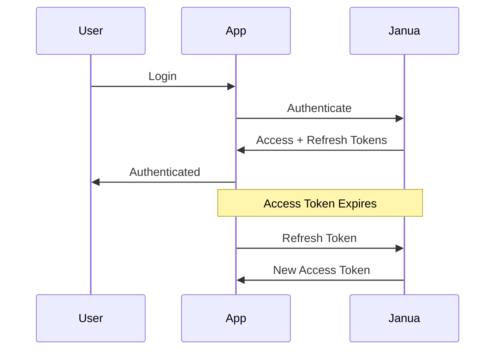

# Session Management

Learn how to manage user sessions, handle token refresh, and implement secure session storage.

## Overview

Janua uses JWT tokens for session management with a dual-token approach:

- **Access Token**: Short-lived (15 minutes), used for API requests
- **Refresh Token**: Long-lived (7 days), used to obtain new access tokens

## Token Lifecycle



## Managing Sessions

### Get Current Session

```typescript
import { janua } from '@janua/typescript-sdk'

const session = await janua.getSession()

if (session) {
  console.log('User:', session.user)
  console.log('Expires:', session.expiresAt)
} else {
  console.log('No active session')
}
```

### Refresh Tokens

```typescript
// Automatic refresh (recommended)
janua.onTokenExpiring(() => {
  janua.refreshToken()
})

// Manual refresh
try {
  const { accessToken, refreshToken } = await janua.refreshToken()
  // Tokens are automatically stored
} catch (error) {
  // Refresh failed, redirect to login
  window.location.href = '/login'
}
```

### Sign Out

```typescript
// Sign out current session
await janua.signOut()

// Sign out from all devices
await janua.signOutFromAllDevices()
```

## Session Storage

### Browser Storage Options

```typescript
// HTTP-only cookies (recommended for web)
const janua = new Janua({
  apiKey: 'your-api-key',
  storage: 'cookie'
})

// Local storage (for SPAs without server)
const janua = new Janua({
  apiKey: 'your-api-key',
  storage: 'localStorage'
})

// Custom storage
const janua = new Janua({
  apiKey: 'your-api-key',
  storage: {
    get: (key) => customStore.get(key),
    set: (key, value) => customStore.set(key, value),
    remove: (key) => customStore.remove(key)
  }
})
```

### Server-Side Sessions

```typescript
// Next.js API Route
import { getSession } from '@janua/nextjs'

export async function GET(request: Request) {
  const session = await getSession(request)

  if (!session) {
    return new Response('Unauthorized', { status: 401 })
  }

  return Response.json({ user: session.user })
}
```

## Device Management

### List Active Sessions

```typescript
const sessions = await janua.sessions.list()

sessions.forEach((session) => {
  console.log(`
    Device: ${session.device}
    Location: ${session.location}
    Last Active: ${session.lastActiveAt}
    Current: ${session.isCurrent}
  `)
})
```

### Revoke Session

```typescript
// Revoke specific session
await janua.sessions.revoke(sessionId)

// Revoke all sessions except current
await janua.sessions.revokeOthers()
```

## React Hooks

```tsx
'use client'

import { useSession, useJanua } from '@janua/react-sdk'

export function SessionInfo() {
  const { session, isLoading, isAuthenticated } = useSession()
  const { signOut } = useJanua()

  if (isLoading) return <div>Loading...</div>

  if (!isAuthenticated) {
    return <div>Not authenticated</div>
  }

  return (
    <div>
      <p>Logged in as: {session.user.email}</p>
      <p>Session expires: {new Date(session.expiresAt).toLocaleString()}</p>
      <button onClick={() => signOut()}>Sign Out</button>
    </div>
  )
}
```

## API Reference

### GET /api/v1/sessions

List all active sessions for the current user.

**Response:**
```json
{
  "sessions": [
    {
      "id": "session-id",
      "device": "Chrome on macOS",
      "ip": "192.168.1.1",
      "location": "San Francisco, CA",
      "createdAt": "2024-01-15T10:30:00Z",
      "lastActiveAt": "2024-01-15T14:45:00Z",
      "isCurrent": true
    }
  ]
}
```

### DELETE /api/v1/sessions/:session_id

Revoke a specific session.

### DELETE /api/v1/sessions

Revoke all sessions except the current one.

### POST /api/v1/auth/token/refresh

Refresh the access token using a valid refresh token.

## Security Best Practices

1. **Use HTTP-only Cookies**: Prevent XSS attacks by storing tokens in HTTP-only cookies
2. **Implement Token Rotation**: Rotate refresh tokens on each use
3. **Set Appropriate Expiry**: Balance security and UX with token lifetimes
4. **Monitor Active Sessions**: Allow users to view and revoke sessions
5. **Detect Suspicious Activity**: Notify users of logins from new devices

## Session Configuration

Configure session behavior in your Janua dashboard or via API:

```typescript
await janua.config.update({
  sessions: {
    accessTokenLifetime: 900, // 15 minutes
    refreshTokenLifetime: 604800, // 7 days
    absoluteSessionLifetime: 2592000, // 30 days
    singleSession: false, // Allow multiple sessions
    requireMfaForNewDevices: true
  }
})
```

## Next Steps

- [Authentication Methods](/guides/authentication) - Configure authentication options
- [Security Best Practices](/guides/security/best-practices) - Secure your implementation
- [Device Management](/guides/sessions/devices) - Track and manage devices
