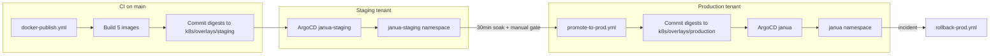

# PP.3b — Janua staging pipeline and consumer provisioning

> Last updated: 2026-05-23  
> PR: [#404](https://github.com/madfam-org/janua/pull/404) (`feat/pp-3b-staging-overlay`)  
> Audit baseline: [PP_3_STAGING_AUDIT.md](./PP_3_STAGING_AUDIT.md)  
> RFC: [internal-devops/rfcs/0001-dev-staging-prod-pipeline.md](https://github.com/madfam-org/internal-devops/blob/main/rfcs/0001-dev-staging-prod-pipeline.md)

This document is the **canonical operator and developer reference** for Janua's
3-tier deploy pipeline (dev → staging → prod) and the OAuth consumer provisioning
path shipped in the May 2026 commercial-GA sprint.

---

## Session deliverables (wrap-up)

| Area | Status | Reference |
|------|--------|-----------|
| `@janua/cli@0.2.0` consumer provisioning | Shipped, published | [packages/cli/README.md](../packages/cli/README.md), [release cli-v0.2.0](https://github.com/madfam-org/janua/releases/tag/cli-v0.2.0) |
| npm.madfam.io auth + ARC runners | Shipped | PRs #398–#403, solarpunk-foundry `npm-madfam-auth` action |
| CEQ Studio OAuth (prod) | Janua side done | Break-glass DB insert; secret in `madfam-org/ceq` → `JANUA_CLIENT_SECRET` |
| PP.3b staging overlay + prod overlay | PR #404 | This document |
| PP.3c promote / rollback workflows | On `main` (awaiting PP.3b paths) | `.github/workflows/promote-to-prod.yml`, `rollback-prod.yml` |
| OAuth `client_id` pin on register API | PR #404 | § Consumer provisioning below |

---

## Pipeline architecture

Janua is **RFC 0001 Pattern B** (manual promote gate). Auth is the ecosystem
floor — a bad prod deploy breaks every downstream login.



### What runs on every push to `main`

| Workflow | Effect |
|----------|--------|
| `docker-publish.yml` | Builds changed services, signs images, commits digests to **`k8s/overlays/staging/kustomization.yaml` only** |
| ArgoCD `janua-staging` (after ops bootstrap) | Reconciles staging namespace |

### What promotes to production

| Workflow | Trigger | Effect |
|----------|---------|--------|
| `promote-to-prod.yml` | `workflow_dispatch` (or schedule if `AUTO_PROMOTE_ENABLED=true`) | Validates ≥30min soak, writes staging digest(s) → `k8s/overlays/production/` |
| `sync-prod-gitops.yml` | `workflow_dispatch` (break-glass) | ARC in-cluster apply when Argo/GHCR block reconcile |
| `rollback-prod.yml` | `workflow_dispatch` (human only) | Writes previous or explicit digest to production overlay; RTO target <5min |

Policy record: `enclii.yaml` → `promotion.pattern: manual`, `min_soak_minutes: 30`.

---

## K8s layout (post PP.3b)

```
k8s/
├── base/                          # Env-agnostic manifests (no image digests)
│   ├── deployments/               # Legacy path — DEPRECATED (no CI digest writes)
│   ├── services/
│   └── hpa-janua-api.yaml
└── overlays/
    ├── dev/                       # Local Minikube/KIND
    ├── staging/                   # janua-staging tenant (CI digest target)
    └── production/                # janua prod tenant (promote-only digests)
```

| Overlay | Namespace | Secrets | Issuer |
|---------|-----------|---------|--------|
| `staging` | `janua-staging` | `janua-staging-secrets` | `https://staging-auth.madfam.io` |
| `production` | `janua` | `janua-secrets` | `https://auth.madfam.io` |

### Staging overlay patches

- **Replicas:** 1 for all five deployments
- **HPA:** min=max=1 on `janua-api`
- **API env:** `ENVIRONMENT=staging`, staging CORS, `ENABLE_DOCS=true`
- **Secrets:** all `secretKeyRef` → `janua-staging-secrets` (via strategic merge in `env-patch-api.yaml`)

---

## Operator bootstrap checklist

Complete these **after PR #404 merges**. Routine ops should move to Enclii once
adapters exist; record gaps when using break-glass.

### 1. ArgoCD applications

| App | Config file | Manifest path | Namespace |
|-----|-------------|---------------|-----------|
| `janua` (prod) | [infra/argocd/config.json](../infra/argocd/config.json) | `k8s/overlays/production` | `janua` |
| `janua-staging` | [infra/argocd/staging-config.json](../infra/argocd/staging-config.json) | `k8s/overlays/staging` | `janua-staging` |

**Action:** Re-point existing `janua` App from `k8s/base/deployments` → `k8s/overlays/production`. Register new `janua-staging` App.

### 2. Namespace and secrets

```bash
# Break-glass — prefer Enclii when adapter exists
kubectl create namespace janua-staging
```

Generate distinct values (never reuse prod):

| Key | Generate |
|-----|----------|
| JWT keypair | `openssl genrsa -out private.pem 2048` + `openssl rsa -pubout` |
| `JWT_SECRET` | `openssl rand -base64 48` |
| `FIELD_ENCRYPTION_KEY` | `python3 -c 'from cryptography.fernet import Fernet; print(Fernet.generate_key().decode())'` |
| `ADMIN_BOOTSTRAP_PASSWORD` | `openssl rand -base64 24` |

Template: [infra/secrets/janua-staging-secrets.template.yaml](../infra/secrets/janua-staging-secrets.template.yaml)  
Registry: [infra/secrets/SECRETS_REGISTRY.yaml](../infra/secrets/SECRETS_REGISTRY.yaml) → `janua-staging` section

**Hard requirements:**

- Separate PostgreSQL database `janua_staging` (never a prod replica)
- Distinct RSA-2048 JWT keypair (compromised staging must not issue prod-valid tokens)
- Distinct Fernet `FIELD_ENCRYPTION_KEY`

### 3. Cloudflare tunnel routes

Add staging hostnames (ops-managed in `enclii/infra/k8s/production/cloudflared-unified.yaml`):

| Public hostname | Service |
|-----------------|---------|
| `staging-auth.madfam.io` | janua-api |
| `staging-api.janua.dev` | janua-api |
| `staging-app.janua.dev` | janua-dashboard |
| `staging-admin.janua.dev` | janua-admin |
| `staging-docs.janua.dev` | janua-docs |

Tunnel routes target **K8s Service port 80**, not container ports (4100–4104).

### 4. Upstream OAuth providers (staging apps)

Register staging OAuth apps with redirect URIs:

```
https://staging-auth.madfam.io/oauth/<provider>/callback
```

Store client IDs/secrets in `janua-staging-secrets`.

### 5. First deploy and promote

1. Merge to `main` → `docker-publish.yml` populates staging digests (replaces zero placeholders).
2. Verify staging: `curl https://staging-auth.madfam.io/health`
3. Wait ≥30 minutes (or `MIN_SOAK_MINUTES` repo variable).
4. Run **Promote staging → prod** workflow (`workflow_dispatch`):
   - Component: `all` (or single service)
   - Reason: required audit string
5. Monitor ArgoCD `janua` App reconcile (~3 min).

**Post-promote reconcile (required):** Updating git does not guarantee live pods
adopt the digest. After every prod promote:

1. `enclii ops apps diff janua-services -n argocd --json` — confirm drift
2. `enclii ops apps sync janua-services -n argocd --apply --reason "..."` if OutOfSync
3. If `janua-website` (or any service) shows `ImagePullBackOff`, refresh
   `janua/ghcr-credentials` via Enclii **Rotate GHCR credentials (namespace)**
   on `madfam-org/enclii` (see [production-gitops-reconcile.md](./runbooks/production-gitops-reconcile.md))

Argo CD Application name is **`janua-services`** (not `janua`).

### 6. Rollback (incident)

Run **Rollback prod** workflow with component + reason. Optionally pass explicit `sha256:...` digest. Shares `prod-promote` concurrency group with promotes — do not run during JWT key rotation.

---

## Consumer OAuth provisioning

### CLI path (recommended)

```bash
npm install -g @janua/cli   # @janua/cli@0.2.0 on npm.madfam.io

export JANUA_INTERNAL_API_KEY=...   # from Enclii/Vault
export JANUA_API_URL=https://auth.madfam.io   # or staging-auth for staging tenant

janua provision plan -f janua.client.yaml
janua provision apply -f janua.client.yaml
janua provision verify -f janua.client.yaml
janua provision export-env -f janua.client.yaml
```

Manifest example with **pinned client_id** (for consumers that require a fixed ID across environments):

```yaml
apiVersion: janua.dev/v1
kind: OAuthClient
metadata:
  name: ceq-studio
spec:
  client_id: jnc_2EJwBz8xGVsGYOO2r3ck5CJH7YrQw4Yk   # optional — API assigns jnc_* if omitted
  audience: ceq-api
  redirect_uris:
    - https://app.ceq.lol/auth/callback
    - http://localhost:5801/auth/callback
  allowed_scopes: [openid, profile, email]
  grant_types: [authorization_code, refresh_token]
  is_confidential: true
```

### Register API

```
POST /api/v1/oauth/clients/register
X-Internal-API-Key: <INTERNAL_API_KEY>
```

| Behavior | Detail |
|----------|--------|
| Idempotent by `name` | Returns 200 + existing client (no secret) |
| Idempotent by `client_id` | Same if name matches |
| Conflict | 409 if `client_id` registered to different name |
| New client | 201 + `client_secret` (shown once) |
| `client_id` format | Must match `jnc_[A-Za-z0-9_-]{8,56}` |

Implementation: [apps/api/app/routers/v1/oauth_clients.py](../apps/api/app/routers/v1/oauth_clients.py)

### CEQ Studio (P0 handoff)

Janua prod registration completed via break-glass DB insert (register API auto-generates IDs). CEQ agent must:

1. Mount `JANUA_CLIENT_SECRET` from `ceq-secrets` in Studio deployment
2. Redeploy Studio
3. Run browser login + `production-smoke.sh`

Secret location: GitHub Actions secret `JANUA_CLIENT_SECRET` on `madfam-org/ceq` (not in repo).

---

## Enclii adapter gaps (record when using break-glass)

| Gap | Workaround used |
|-----|-----------------|
| OAuth client provisioning with fixed `client_id` | DB insert / register API `client_id` pin (PP.3b) |
| npm token rotation publish smoke | solarpunk-foundry `npm-madfam-auth` + ARC runners |
| Staging namespace + secrets bootstrap | Manual template apply |
| ArgoCD App registration for `janua-staging` | `infra/argocd/staging-config.json` + ops |

---

## Compliance snapshot (post PP.3b)

| RFC 0001 area | Before PP.3 | After PP.3b merge + ops bootstrap |
|---------------|-------------|-----------------------------------|
| Staging overlay | Missing | In repo; needs ArgoCD + secrets |
| Prod overlay | Digests in base | `k8s/overlays/production` |
| CI → staging digests | Direct to prod | `docker-publish` → staging only |
| Promote / rollback | Missing on main | Workflows live; need overlay paths |
| Staging smoke in CI | Missing | **Still open** (future PR) |
| Staging subdomains | Missing | **Ops action** |
| Masked DB refresh | Deferred | Deferred |

Estimated compliance after code merge: **~55%** (structural + workflows).  
Estimated after full ops bootstrap: **~75%** (smoke + masked DB still deferred).

---

## Related docs

- [PP_3_STAGING_AUDIT.md](./PP_3_STAGING_AUDIT.md) — original gap analysis
- [AGENTS.md](../AGENTS.md) — deployment pipeline summary
- [internal-devops/runbooks/staging-bootstrap.md](https://github.com/madfam-org/internal-devops/blob/main/runbooks/staging-bootstrap.md)
- [packages/cli/README.md](../packages/cli/README.md) — CLI provisioning
- [examples/consumer-bootstrap/](../examples/consumer-bootstrap/) — manifest templates
