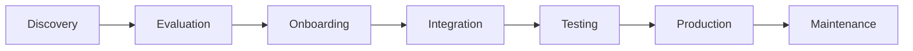

# Developer Integrator Journey

**Persona**: Software developers and technical teams integrating Janua authentication into their applications

**Primary Goal**: Successfully integrate Janua authentication with minimal friction and achieve production readiness

## Journey Overview



## Stage 1: Discovery

### Touchpoints
- Marketing landing page (`apps/landing`)
- Developer documentation (`docs/development/`)
- GitHub repository
- Search engine results
- Developer community forums

### Goals
- Understand what Janua offers
- Compare with Auth0, Clerk, Supabase
- Assess technical fit for project needs

### Expected Experience
**Landing Page** should clearly communicate:
- "Drop-in authentication for modern applications"
- Key differentiators: privacy-first, edge-native, open-source
- Supported platforms: Web, Mobile, Desktop
- Pricing transparency

**Critical Claims to Validate**:
- ✅ "5-minute integration" → Must be achievable in quickstart
- ✅ "Production-ready SDKs" → All SDKs must have working dist/ builds
- ✅ "Zero vendor lock-in" → Data export and migration tools exist
- ✅ "SOC2 compliant" → Compliance documentation and audit logs available

### Validation Tests
```typescript
// tests/e2e/journeys/developer-integrator.spec.ts
test('Discovery: Landing page reflects actual capabilities', async ({ page }) => {
  await page.goto('http://localhost:3000');
  
  // Validate key messaging exists
  await expect(page.locator('h1')).toContainText('Identity Platform');
  
  // Verify claimed features match implementations
  const features = await page.locator('[data-testid="feature-list"] li').allTextContents();
  expect(features).toContain('Multi-factor Authentication');
  expect(features).toContain('Passkey Support');
  expect(features).toContain('Session Management');
});
```

## Stage 2: Evaluation

### Touchpoints
- API documentation (`docs/api/`)
- SDK documentation (`packages/*/README.md`)
- Code examples (`examples/`)
- Pricing page
- Security & compliance docs

### Goals
- Verify technical capabilities match requirements
- Assess integration complexity
- Evaluate pricing vs. competitors
- Confirm security/compliance needs met

### Expected Experience
**Documentation Quality**:
- Complete API reference with examples
- Working code samples for all features
- Clear migration guides from competitors
- Transparent pricing with calculator

**Technical Verification**:
- Can install SDK via npm/yarn
- TypeScript definitions available
- Framework integrations documented (React, Vue, Next.js)
- Security best practices covered

### Validation Tests
```typescript
test('Evaluation: Documentation matches SDK capabilities', async ({ page }) => {
  await page.goto('http://localhost:3000/docs');
  
  // Get quickstart code example
  const codeExample = await page.locator('[data-testid="quickstart-code"]').textContent();
  
  // Validate SDK initialization code is correct
  expect(codeExample).toContain('new JanuaClient');
  expect(codeExample).toContain('apiKey');
  
  // Verify pricing claims match billing service limits
  await page.goto('http://localhost:3000/pricing');
  const freeTierLimit = await page.locator('[data-testid="free-tier-users"]').textContent();
  
  // This must match app/services/billing.ts enforcement
  expect(freeTierLimit).toBe('1,000 users');
});
```

### Content-Functionality Alignment
| Marketing Claim | Code Validation |
|----------------|-----------------|
| "React SDK with hooks" | `packages/react-sdk/src/hooks/` exports useAuth, useSession |
| "Next.js middleware support" | `packages/nextjs-sdk/src/middleware.ts` exists and works |
| "GDPR compliant" | `app/compliance/privacy/` implements data subject rights |
| "99.9% uptime SLA" | `monitoring/` has health checks and alerting |

## Stage 3: Onboarding

### Touchpoints
- Signup flow (`apps/landing/signup`)
- Dashboard onboarding (`apps/dashboard`)
- Quickstart guide
- API key generation
- First SDK installation

### Goals
- Create account quickly (<2 minutes)
- Generate API credentials
- Install and configure SDK
- See "hello world" authentication working

### Expected Experience
**Signup Flow**:
- Email/password or OAuth signup
- Email verification (optional for dev)
- Immediate API key access
- No credit card required for free tier

**Quickstart Success**:
- SDK installs without errors
- Example code runs successfully
- Authentication flow works in <5 minutes
- Clear next steps provided

### Validation Tests
```typescript
test('Onboarding: SDK installation works as documented', async ({ page }) => {
  // Navigate to quickstart
  await page.goto('http://localhost:3000/docs/quickstart');
  
  // Get installation command
  const installCmd = await page.locator('[data-testid="install-command"]').textContent();
  expect(installCmd).toContain('npm install @janua/typescript-sdk');
  
  // Validate package actually exists and is published
  // (In local testing, verify dist/ exists)
  
  // Test example code from docs
  const exampleCode = await page.locator('[data-testid="example-code"]').textContent();
  
  // This should compile and run successfully
  // Actual implementation validation happens in SDK tests
});
```

## Stage 4: Integration

### Touchpoints
- SDK documentation
- Code editor (TypeScript support)
- Development server
- Browser DevTools
- Error messages and debugging

### Goals
- Implement signup/login flows
- Add session management
- Configure MFA (optional)
- Handle edge cases and errors
- Test user experience

### Expected Experience
**Development Experience**:
- TypeScript autocomplete works
- Clear error messages guide resolution
- Examples cover common use cases
- Migration guides from other providers available

**Integration Complexity**:
- Basic auth: 3-4 files to modify
- MFA setup: 1 additional component
- Session management: Automatic with SDK
- Customization: Well-documented hooks/callbacks

### Validation Tests
```typescript
test('Integration: Core authentication workflows work', async ({ page }) => {
  // Test app using Janua SDK
  await page.goto('http://localhost:3001/test-app');
  
  // Complete signup flow
  await page.fill('[data-testid="email"]', 'dev@example.com');
  await page.fill('[data-testid="password"]', 'SecureP@ss123');
  await page.click('[data-testid="signup-button"]');
  
  // Validate signup succeeds
  await expect(page.locator('[data-testid="signup-success"]')).toBeVisible();
  
  // Test login flow
  await page.fill('[data-testid="login-email"]', 'dev@example.com');
  await page.fill('[data-testid="login-password"]', 'SecureP@ss123');
  await page.click('[data-testid="login-button"]');
  
  // Validate dashboard access
  await expect(page.locator('[data-testid="dashboard"]')).toBeVisible();
});
```

## Stage 5: Testing

### Touchpoints
- Local test environment
- Staging environment
- Test user management
- Debugging tools
- Performance monitoring

### Goals
- Verify authentication works in test environment
- Load test with realistic traffic
- Test edge cases and error handling
- Validate security best practices
- Confirm performance meets requirements

### Expected Experience
**Testing Tools**:
- Test API keys separate from production
- Easy user creation/deletion for testing
- Clear test data cleanup procedures
- Performance benchmarks documented

**Quality Assurance**:
- Security scan passes (no XSS, CSRF, etc.)
- Load testing shows acceptable performance
- Error handling is user-friendly
- Session management works across devices

### Validation Tests
```typescript
test('Testing: Performance meets documented expectations', async ({ page }) => {
  const startTime = Date.now();
  
  // Complete full authentication flow
  await page.goto('http://localhost:3001/test-app');
  await page.fill('[data-testid="email"]', 'test@example.com');
  await page.fill('[data-testid="password"]', 'TestP@ss123');
  await page.click('[data-testid="signup-button"]');
  await expect(page.locator('[data-testid="dashboard"]')).toBeVisible();
  
  const elapsed = Date.now() - startTime;
  
  // Marketing claims "<1s authentication" - validate
  expect(elapsed).toBeLessThan(1000);
});
```

## Stage 6: Production

### Touchpoints
- Production deployment
- Monitoring dashboards
- Error tracking
- User analytics
- Support documentation

### Goals
- Deploy to production safely
- Monitor authentication health
- Handle user issues quickly
- Scale as needed
- Maintain security compliance

### Expected Experience
**Deployment**:
- Environment variable migration straightforward
- No breaking changes from test to prod
- Health checks and monitoring configured
- Rollback procedures documented

**Operations**:
- Real-time error alerting
- Performance metrics accessible
- User activity analytics available
- Security event logging active

### Validation Tests
```typescript
test('Production: Monitoring and health checks operational', async ({ page }) => {
  // Check health endpoint responds
  const response = await page.request.get('http://localhost:8000/health');
  expect(response.ok()).toBeTruthy();
  
  // Verify metrics endpoint exists
  const metrics = await page.request.get('http://localhost:8000/metrics');
  expect(metrics.ok()).toBeTruthy();
  
  // Check audit logging is active
  await page.goto('http://localhost:3001/test-app/dashboard');
  // Login event should be logged
  // Validation happens via API test
});
```

## Stage 7: Maintenance

### Touchpoints
- SDK updates
- Security patches
- Feature additions
- Migration guides
- Support tickets

### Goals
- Keep authentication up-to-date
- Address security vulnerabilities quickly
- Add new features as needed
- Minimize breaking changes
- Maintain developer productivity

### Expected Experience
**Updates**:
- Semantic versioning followed strictly
- Breaking changes documented clearly
- Migration guides for major versions
- Security patches released promptly

**Support**:
- Comprehensive troubleshooting docs
- Active community forums
- Professional support options
- Clear escalation paths

## Key Performance Indicators

### Success Metrics
- **Time to First Auth**: <5 minutes from SDK install to working login
- **Integration Completion**: >80% of developers complete full integration
- **Documentation Satisfaction**: >4.5/5 rating
- **Support Ticket Volume**: <5% of developers need support

### Friction Points to Monitor
- SDK installation failures
- TypeScript configuration issues
- API key generation confusion
- Example code not working
- Migration complexity from competitors

## Journey Validation Checklist

Before deploying updates affecting developers:

- [ ] All marketing claims verified against codebase
- [ ] SDK builds successfully with dist/ directories
- [ ] Quickstart examples run without errors
- [ ] Documentation reflects current API
- [ ] Pricing page matches billing service limits
- [ ] Performance meets documented expectations
- [ ] Security best practices validated
- [ ] Migration guides tested end-to-end

## Related Journeys

- **End User**: Developers hand off to these users after integration
- **Security Admin**: Developers may escalate to security team for enterprise setup
- **Business Decision Maker**: Developers may recommend Janua after successful integration
