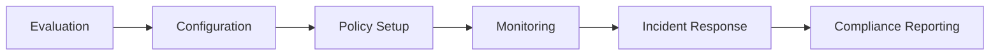

# Security Admin Journey

**Persona**: Security professionals, compliance officers, and IT administrators managing enterprise authentication and access control

**Primary Goal**: Configure, monitor, and maintain secure authentication infrastructure that meets compliance requirements

## Journey Overview



## Stage 1: Evaluation

### Touchpoints
- Security documentation (`docs/security/`)
- Compliance documentation (`docs/enterprise/compliance/`)
- Security whitepaper
- SOC2/GDPR audit reports
- Penetration test results

### Goals
- Assess security architecture
- Verify compliance certifications
- Evaluate threat protection capabilities
- Review incident response procedures

### Expected Experience
**Security Documentation**:
- Comprehensive threat model
- Security architecture diagram
- Encryption standards (data at rest/transit)
- Authentication protocols (OAuth 2.1, OIDC, WebAuthn)
- Vulnerability disclosure policy

**Compliance Evidence**:
- SOC2 Type II report
- GDPR compliance documentation
- CCPA compliance guide
- HIPAA compliance capabilities (if applicable)
- Security certifications and attestations

### Validation Tests
```typescript
// tests/e2e/journeys/security-admin.spec.ts
test('Evaluation: Security documentation is comprehensive', async ({ page }) => {
  await page.goto('http://localhost:3000/security');
  
  // Key security topics documented
  const topics = await page.locator('[data-testid="security-topics"] li').allTextContents();
  expect(topics).toContain('Data Encryption');
  expect(topics).toContain('Threat Protection');
  expect(topics).toContain('Audit Logging');
  expect(topics).toContain('Compliance Certifications');
  
  // SOC2 report available
  await expect(page.locator('[data-testid="soc2-report"]')).toBeVisible();
});
```

## Stage 2: Configuration

### Touchpoints
- Admin dashboard (`apps/dashboard/admin/`)
- Organization settings
- SSO configuration
- API key management
- Environment configuration

### Goals
- Configure organization settings
- Setup SSO/SAML integration
- Define authentication policies
- Configure audit logging
- Establish security baselines

### Expected Experience
**Organization Setup**:
- Multi-tenant organization structure
- Role-based access control (RBAC)
- SSO provider integration (Okta, Azure AD, Google Workspace)
- Custom branding and domain
- Environment separation (dev/staging/prod)

**Security Configuration**:
- Password policies (length, complexity, rotation)
- Session timeout settings
- MFA enforcement options
- IP allowlist/blocklist
- Rate limiting configuration

### Validation Tests
```typescript
test('Configuration: SSO integration setup works', async ({ page }) => {
  await page.goto('http://localhost:3001/admin/sso');
  
  // SSO provider selection
  await page.click('[data-testid="add-sso-provider"]');
  await page.selectOption('[data-testid="sso-type"]', 'saml');
  
  // SAML configuration
  await page.fill('[data-testid="saml-entity-id"]', 'https://idp.example.com/app/abcd1234');
  await page.fill('[data-testid="saml-sso-url"]', 'https://idp.example.com/app/abcd1234/sso/saml');
  await page.fill('[data-testid="saml-certificate"]', '-----BEGIN CERTIFICATE-----\n...\n-----END CERTIFICATE-----');
  
  // Save configuration
  await page.click('[data-testid="save-sso-config"]');
  
  // Configuration saved successfully
  await expect(page.locator('[data-testid="sso-config-saved"]')).toBeVisible();
});

test('Password Policy: Enforce strong password requirements', async ({ page }) => {
  await page.goto('http://localhost:3001/admin/security/policies');
  
  // Configure password policy
  await page.fill('[data-testid="min-password-length"]', '12');
  await page.check('[data-testid="require-uppercase"]');
  await page.check('[data-testid="require-lowercase"]');
  await page.check('[data-testid="require-numbers"]');
  await page.check('[data-testid="require-symbols"]');
  await page.fill('[data-testid="password-rotation-days"]', '90');
  
  // Save policy
  await page.click('[data-testid="save-password-policy"]');
  
  // Validate policy is enforced
  await expect(page.locator('[data-testid="policy-active"]')).toBeVisible();
});
```

## Stage 3: Policy Setup

### Touchpoints
- Policy engine configuration
- Access control rules
- Conditional access policies
- Risk-based authentication
- Compliance policy templates

### Goals
- Define access policies
- Configure MFA requirements
- Setup conditional access rules
- Implement zero-trust principles
- Establish compliance baselines

### Expected Experience
**Policy Management**:
- Template-based policy creation
- Conditional access (location, device, risk level)
- MFA enforcement (per-user, per-group, per-app)
- Session management policies
- Data classification and access

**Zero-Trust Configuration**:
- Device trust verification
- Continuous authentication
- Least privilege access
- Network segmentation
- Micro-segmentation support

### Validation Tests
```typescript
test('Policy Setup: Configure conditional access rules', async ({ page }) => {
  await page.goto('http://localhost:3001/admin/policies');
  
  // Create new policy
  await page.click('[data-testid="create-policy"]');
  await page.fill('[data-testid="policy-name"]', 'MFA Required for Admin Access');
  
  // Define conditions
  await page.selectOption('[data-testid="policy-condition"]', 'role');
  await page.selectOption('[data-testid="condition-value"]', 'admin');
  
  // Define action
  await page.selectOption('[data-testid="policy-action"]', 'require-mfa');
  
  // Save policy
  await page.click('[data-testid="save-policy"]');
  
  // Policy created successfully
  await expect(page.locator('[data-testid="policy-created"]')).toBeVisible();
  
  // Verify policy is active
  const policyStatus = await page.locator('[data-testid="policy-status"]').textContent();
  expect(policyStatus).toBe('Active');
});
```

## Stage 4: Monitoring

### Touchpoints
- Security dashboard
- Audit log viewer
- Real-time alerts
- Analytics and reporting
- SIEM integration

### Goals
- Monitor authentication events
- Track security incidents
- Analyze user behavior
- Detect anomalies
- Respond to threats

### Expected Experience
**Security Monitoring**:
- Real-time authentication dashboard
- Failed login attempt tracking
- Suspicious activity alerts
- Geographic anomaly detection
- Device fingerprinting

**Audit Logging**:
- Comprehensive event logging
- Searchable audit logs
- Log retention policies
- Export to SIEM (Splunk, Datadog, etc.)
- Tamper-proof log storage

### Validation Tests
```typescript
test('Monitoring: Audit logs capture authentication events', async ({ page }) => {
  await page.goto('http://localhost:3001/admin/audit-logs');
  
  // Audit log viewer is accessible
  await expect(page.locator('[data-testid="audit-log-table"]')).toBeVisible();
  
  // Perform authentication event (trigger log entry)
  await page.goto('http://localhost:3001/test-app');
  await page.fill('[data-testid="login-email"]', 'test@example.com');
  await page.fill('[data-testid="login-password"]', 'TestP@ss123');
  await page.click('[data-testid="login-submit"]');
  
  // Return to audit logs
  await page.goto('http://localhost:3001/admin/audit-logs');
  
  // Verify login event was logged
  await page.fill('[data-testid="log-search"]', 'test@example.com');
  await page.click('[data-testid="search-logs"]');
  
  // Login event should appear
  const logEntries = await page.locator('[data-testid="log-entry"]').allTextContents();
  const loginEvent = logEntries.some(entry => entry.includes('login') && entry.includes('test@example.com'));
  expect(loginEvent).toBeTruthy();
});

test('Alerts: Failed login attempts trigger security alerts', async ({ page }) => {
  // Attempt multiple failed logins
  for (let i = 0; i < 5; i++) {
    await page.goto('http://localhost:3001/test-app');
    await page.fill('[data-testid="login-email"]', 'test@example.com');
    await page.fill('[data-testid="login-password"]', 'WrongPassword123');
    await page.click('[data-testid="login-submit"]');
    await page.waitForTimeout(500);
  }
  
  // Check security dashboard for alert
  await page.goto('http://localhost:3001/admin/security');
  
  // Alert should be visible
  await expect(page.locator('[data-testid="security-alert"]')).toBeVisible();
  const alertText = await page.locator('[data-testid="security-alert"]').textContent();
  expect(alertText).toContain('Multiple failed login attempts');
});
```

## Stage 5: Incident Response

### Touchpoints
- Security incident dashboard
- User account management
- Session termination
- IP blocking
- Incident reporting

### Goals
- Respond to security incidents quickly
- Terminate compromised sessions
- Block malicious actors
- Investigate security events
- Document incidents

### Expected Experience
**Incident Management**:
- Real-time incident alerts
- One-click session termination
- IP address blocking
- User account locking/suspension
- Forensic log export

**Response Tools**:
- Force password reset
- Revoke API keys
- Disable SSO connections
- Emergency access controls
- Incident timeline reconstruction

### Validation Tests
```typescript
test('Incident Response: Terminate user sessions remotely', async ({ page }) => {
  // Login as admin
  await page.goto('http://localhost:3001/admin/users');
  
  // Find user with active sessions
  await page.fill('[data-testid="user-search"]', 'test@example.com');
  await page.click('[data-testid="search-users"]');
  await page.click('[data-testid="user-details"]');
  
  // View active sessions
  await expect(page.locator('[data-testid="active-sessions"]')).toBeVisible();
  
  // Terminate all sessions
  await page.click('[data-testid="terminate-all-sessions"]');
  
  // Confirmation dialog
  await page.click('[data-testid="confirm-terminate"]');
  
  // Sessions terminated
  await expect(page.locator('[data-testid="sessions-terminated"]')).toBeVisible();
  
  // User should be logged out (verify in separate test)
});

test('Block IP Address: Prevent access from malicious sources', async ({ page }) => {
  await page.goto('http://localhost:3001/admin/security/ip-management');
  
  // Add IP to blocklist
  await page.fill('[data-testid="ip-address"]', '192.168.1.100');
  await page.fill('[data-testid="block-reason"]', 'Brute force attack detected');
  await page.click('[data-testid="block-ip"]');
  
  // IP blocked successfully
  await expect(page.locator('[data-testid="ip-blocked"]')).toBeVisible();
  
  // Verify IP appears in blocklist
  const blocklist = await page.locator('[data-testid="blocked-ip"]').allTextContents();
  expect(blocklist).toContain('192.168.1.100');
});
```

## Stage 6: Compliance Reporting

### Touchpoints
- Compliance dashboard
- Audit report generation
- Access review reports
- Certification documentation
- Regulatory exports

### Goals
- Generate compliance reports
- Perform access reviews
- Demonstrate regulatory compliance
- Prepare for audits
- Document security posture

### Expected Experience
**Compliance Reports**:
- Pre-built compliance templates (SOC2, GDPR, HIPAA)
- Automated report generation
- Custom report builder
- Scheduled reporting
- Export formats (PDF, CSV, JSON)

**Audit Support**:
- Access certification campaigns
- User activity reports
- Policy compliance status
- Vulnerability scan results
- Third-party audit support

### Validation Tests
```typescript
test('Compliance Reporting: Generate SOC2 compliance report', async ({ page }) => {
  await page.goto('http://localhost:3001/admin/compliance');
  
  // Select report type
  await page.selectOption('[data-testid="report-type"]', 'soc2');
  
  // Set date range
  await page.fill('[data-testid="report-start-date"]', '2025-01-01');
  await page.fill('[data-testid="report-end-date"]', '2025-01-31');
  
  // Generate report
  await page.click('[data-testid="generate-report"]');
  
  // Report generation in progress
  await expect(page.locator('[data-testid="report-generating"]')).toBeVisible();
  
  // Wait for completion
  await expect(page.locator('[data-testid="report-ready"]')).toBeVisible({ timeout: 30000 });
  
  // Download report
  const [download] = await Promise.all([
    page.waitForEvent('download'),
    page.click('[data-testid="download-report"]')
  ]);
  
  expect(download.suggestedFilename()).toContain('soc2-compliance-report');
});

test('Access Review: Perform user access certification', async ({ page }) => {
  await page.goto('http://localhost:3001/admin/compliance/access-review');
  
  // Start access review campaign
  await page.click('[data-testid="start-access-review"]');
  await page.fill('[data-testid="review-name"]', 'Q1 2025 Access Review');
  await page.selectOption('[data-testid="review-scope"]', 'all-users');
  await page.click('[data-testid="launch-review"]');
  
  // Review campaign started
  await expect(page.locator('[data-testid="review-launched"]')).toBeVisible();
  
  // Review user access
  await page.click('[data-testid="review-users"]');
  
  // Certify or revoke access
  await page.click('[data-testid="certify-access-0"]'); // Certify first user
  await page.click('[data-testid="revoke-access-1"]');  // Revoke second user
  
  // Submit review
  await page.click('[data-testid="submit-review"]');
  
  // Review completed
  await expect(page.locator('[data-testid="review-complete"]')).toBeVisible();
});
```

## Key Performance Indicators

### Success Metrics
- **Incident Detection Time**: <5 minutes average
- **Incident Response Time**: <30 minutes average
- **Audit Log Completeness**: 100% of authentication events logged
- **Policy Compliance**: >95% of access requests comply with policies
- **Certification Campaign Completion**: >90% completion rate

### Friction Points to Monitor
- Complex policy configuration
- Overwhelming alert volume
- Difficult audit log navigation
- Slow incident response tools
- Compliance report generation delays

## Journey Validation Checklist

Before deploying updates affecting security admins:

- [ ] SSO/SAML integration setup works correctly
- [ ] Password policies enforce as configured
- [ ] Conditional access policies apply correctly
- [ ] Audit logs capture all authentication events
- [ ] Security alerts trigger appropriately
- [ ] Session termination works immediately
- [ ] IP blocking prevents access
- [ ] Compliance reports generate successfully
- [ ] Access review campaigns function correctly
- [ ] SIEM integration exports logs properly

## Content-Functionality Alignment

| Marketing Claim | Code Validation |
|----------------|-----------------|
| "Comprehensive audit logging" | `app/services/audit_logger.py` logs all auth events |
| "SOC2 Type II certified" | `docs/compliance/soc2-report.pdf` exists and current |
| "Zero-trust architecture" | `app/middleware/policy_engine.py` enforces continuous verification |
| "SIEM integration ready" | `app/integrations/siem/` supports Splunk, Datadog, etc. |
| "Real-time threat detection" | `app/services/anomaly_detection.py` active and alerting |

## Related Journeys

- **Developer Integrator**: Security admins configure policies developers must implement
- **End User**: Security settings affect end user authentication experience
- **Business Decision Maker**: Security compliance influences purchase decisions
